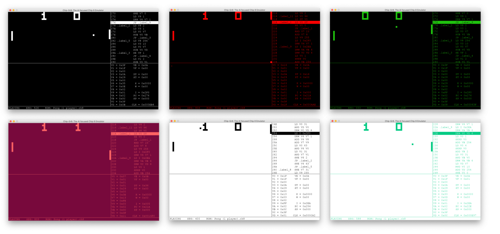

Chip-Gr8 is a sandbox for creating AI Agents for retro video games like Pong, Breakout, and Space Invaders \[1\]. Chip-Gr8 lets you interactively program AI agents, easily record their behaviour, collect data, pause and play their actions, and even play against them! If you have never programmed an AI before, Chip-Gr8 is a great place to start!

# Installing

Chip-Gr8 is a Python package. Use pip to install it!

```readonly-nolines
pip isntall chipgrr8
```

# Getting Started

If you want to play a game using Chip-Gr8, all you have to do is start it on the command line! For example, to play breakout you would run

```readonly-nolines
python -m chipgr8 -r breakout
```

You will be greated by the Chip-Gr8 display and can start playing!


Creating an AI Agent is just as straightforward, just dropping the following code into your favorite text editor and you are ready to go! 

```lang:python-readonly
import chipgr8
from chipgr8.games import Breakout

vm = chipgr8.init(display=True, ROM=Breakout.ROM)
while not vm.done():
    vm.act(Breakout.actions.left)
```

To find out more about Chip-Gr8, its API, included games, and more examples, download the [Reference Manual](../static/Chip-Gr8-Reference-Manual.pdf), or head over to the [docs](../docs)! 

## Themes
The Chip-Gr8 UI harkons back to the retro games it houses, but modern conveniences are not all gone. You can play and watch your AI agent play in style with customizable themes, here are some of our favorites!



# The Project
Chip-Gr8 is the capstone project for six engineering students at the University of Victoria. Chip-Gr8's goal is to provide a high performance CHIP-8 emulator and a user friendly Python API that seamlessly integrates with modern machine learning and AI libraries. Inspiration for the Chip-Gr8 project came from similar emulation + AI combinations of the [SNES](https://www.youtube.com/watch?v=qv6UVOQ0F44) \[2\] and [Atari](https://arxiv.org/pdf/1312.5602v1.pdf) \[3\] systems.

## What is Chip-Gr8?
At its core, Chip-Gr8 is an emulator of the CHIP-8 system. Developed in the 1970's by [Joseph Weisbecker](https://en.wikipedia.org/wiki/Joseph_Weisbecker#Small_systems) \[4\], CHIP-8 was meant to be a simple system that programmers could use for beginner video game development. Many simple games, including Pong, Space Invaders, and Breakout, were programmed for the CHIP-8 throughout the 70s and 80s.

What seperates Chip-Gr8 from similar CHIP-8 emulation projects is its occus on enabling AI agents. Chip-Gr8 provides pre-built memory maps that translate the CHIP-8's 4K RAM into relevant game data like player position, lives, and game time. Included with this data are the tools used to gather it, meaning new features can easily be added using a similar querying model used by popular gameing memory tools like [Cheat Engine](https://www.cheatengine.org/) \[5\]. The CHIP-8 emulator itself is implemented in C and designed to be run in parallel, making it easy to train many AI agents at once. 

Chip-Gr8 aims to scale with a user's development goals, from procedural AIs the follow the ball in pong, to a decision tree that makes a decisions based off environmental features, to a neural network trained on the pixel buffer of games. 

## Technology Stack
The Chip-Gr8 API is written in Python to ensure that it could interact with the best open source AI libraries available, like [scikit-learn](https://scikit-learn.org/stable/) \[6\], [PyTorch](https://pytorch.org/) \[7\], and [TensorFlow](https://www.tensorflow.org/) library \[8\]. Chip-Gr8 is built enitrely ontop of open source software. Chip-Gr8 depends on

- [NumPy](https://numpy.org/) for presenting numeric data \[9\],
- [PyGame](https://www.pygame.org/news) for rendering a cross platform display \[10\],
- and [Lazyarray](https://lazyarray.readthedocs.io/en/latest/) for sparse data accesses \[11\].

# Project Timeline

Primary development of Chip-Gr8 occured over the Summer of 2019, the timeline below outlines Chip-Gr8's progress.
